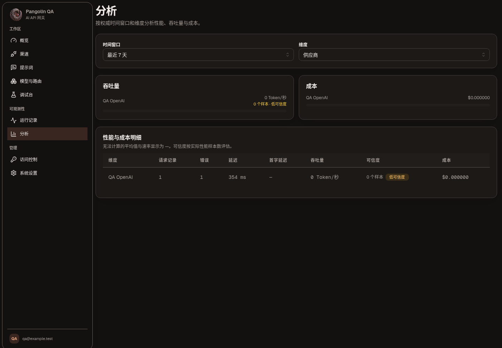
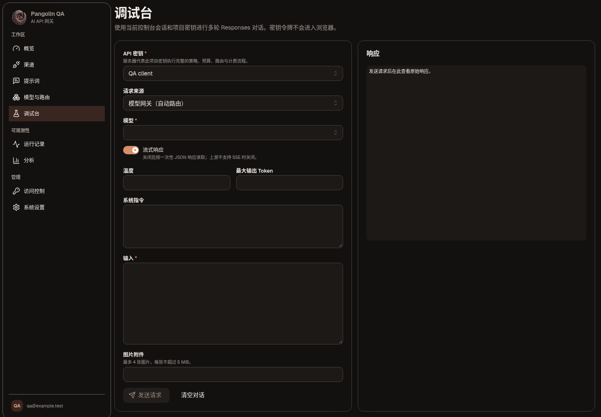
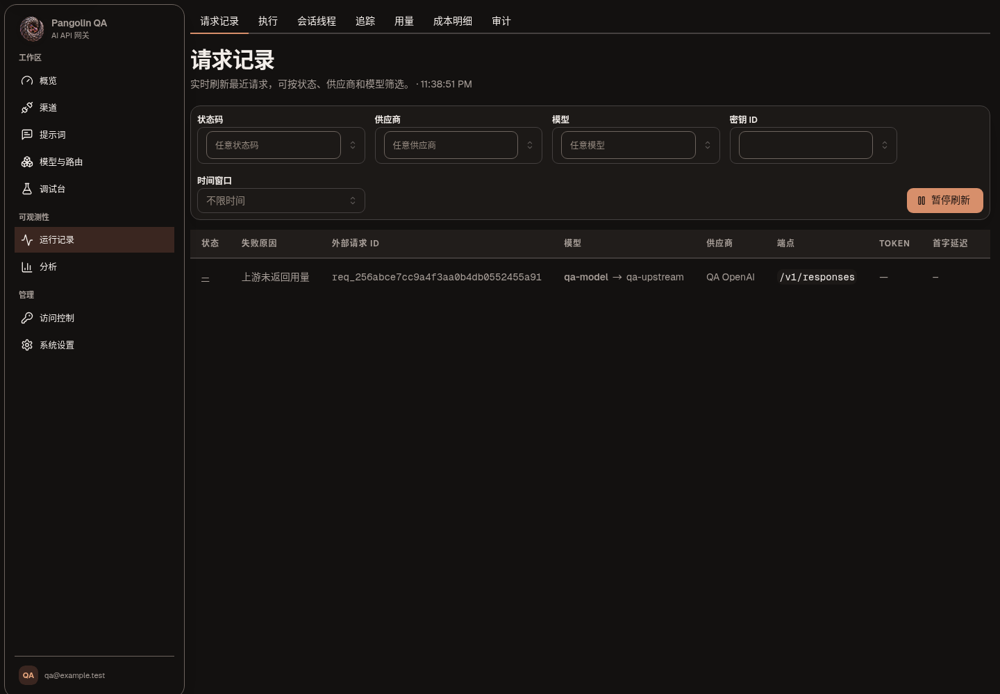
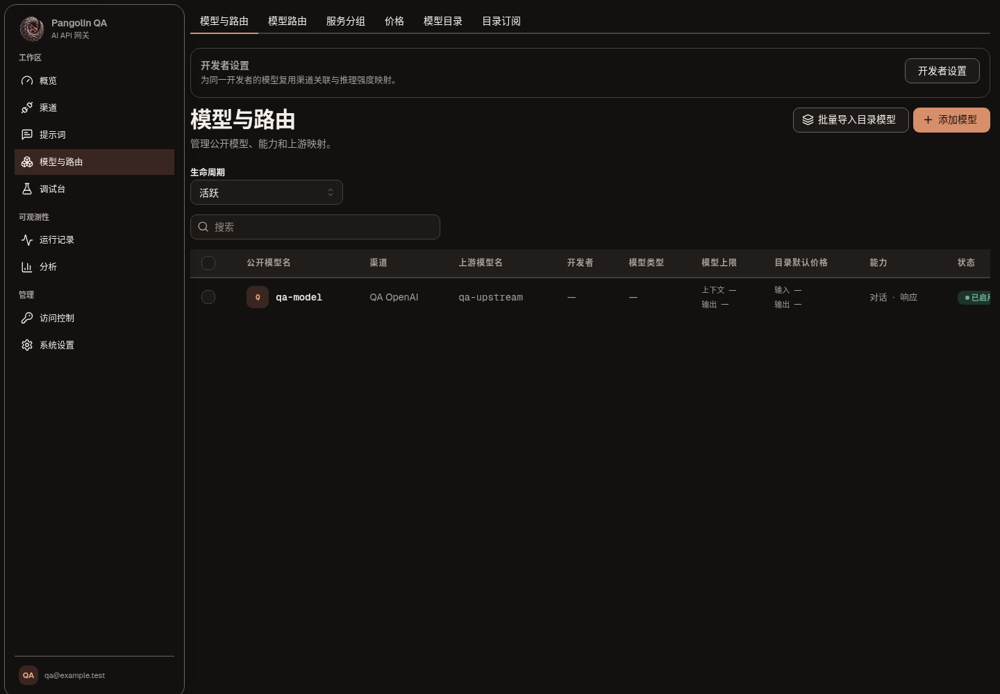
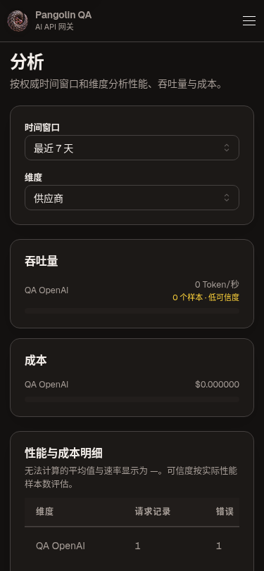
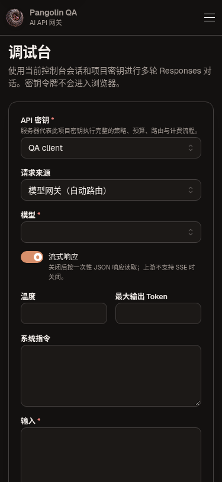
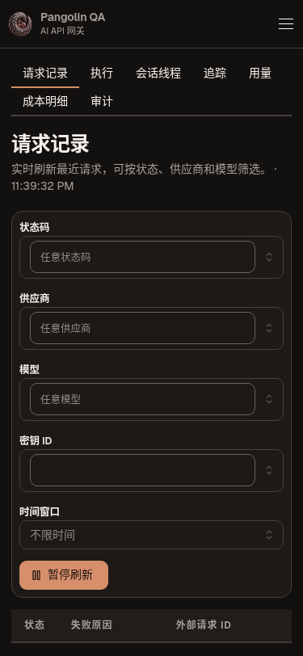
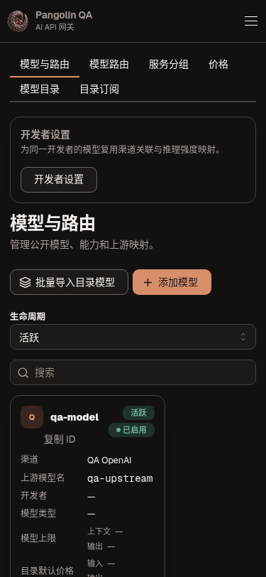

<p align="center">
  <strong>English</strong> · <a href="README.zh-CN.md">简体中文</a>
</p>

<p align="center">
  
</p>

<h1 align="center">Pangolin · 鲮鲤</h1>

<p align="center">One refined, observable, self-hosted Rust gateway for your AI APIs.</p>

Pangolin (Chinese name 鲮鲤) is a single-binary AI API aggregation gateway. It exposes OpenAI-compatible and Anthropic Messages endpoints, provider and model routing, virtual API keys, cost accounting and request tracing, and embeds its bilingual React console directly into the Rust executable.

## Features

- Chat, Responses, embeddings, image, audio, video, rerank and async job endpoints for OpenAI, Anthropic, Gemini, Jina and compatible providers
- Exact, regex, tag and conditional model routing with failover, round-robin, weighted, least-busy, latency-first, sticky routing and circuit breaking
- Projects, users, roles, invitations, OIDC, API key profiles, and IP, quota, budget and logging policies
- Multiple encrypted credentials per channel with priority, rotation, bulk enable/disable, probing, quotas and auto-disable
- Built-in provider and model catalogue with brand icons, capability and price metadata; import, export, signed subscriptions, refresh and rollback
- Thread → Trace → Request → Execution → Usage/Cost observability end to end, plus an explainable routing preview
- SeaORM + SQLite as the authoritative record system, DuckDB as an independent analytical projection; encrypted per-project and whole-instance backup and restore
- Site-level and API-key-level request logging policy that keeps sensitive bodies out by default, with optional exact session replay and compaction
- Web setup wizard or unattended environment-variable initialization
- Bilingual Chinese/English console, system/light/dark modes, and 16 interface styles × 20 colour palettes
- Embedded React console in a single binary and a non-root Docker image
- GitHub Actions builds Linux/macOS/Windows binaries and amd64/arm64 images natively

## Screenshots

### Desktop

| Overview (light) | Overview (dark) | Channels |
| --- | --- | --- |
|  |  |  |

| Model routing | Requests | Request detail |
| --- | --- | --- |
|  |  |  |

| Analytics | Playground | Operations | Models |
| --- | --- | --- | --- |
|  |  |  |  |

| Trace detail | Access control | System settings | About |
| --- | --- | --- | --- |
|  |  |  |  |

### Themes

Interface style (16) and colour palette (20) are independent axes layered on top of light/dark. The styles follow the `ui-ux-pro-max` style catalogue and are implemented in its visual language; the palettes come from its product colour catalogue. Every combination is covered by an automated contrast audit (20 palettes × 2 modes × 23 pairs). See [design-system/pangolin/THEMES.md](design-system/pangolin/THEMES.md).

| Pangolin house | Frosted glass | Clay |
| --- | --- | --- |
|  |  |  |

| Aurora | Sci-fi HUD | Editorial |
| --- | --- | --- |
|  |  |  |

### Mobile

| Overview | Channels | Credentials | Trace detail |
| --- | --- | --- | --- |
|  |  |  |  |

| Analytics | Playground | Operations | Models |
| --- | --- | --- | --- |
|  |  |  |  |

## Quick start

```bash
docker run --name pangolin \
  -p 8080:8080 \
  -v pangolin-data:/data \
  ghcr.io/ca-x/pangolin:latest
```

Open `http://localhost:8080`, create the first administrator with the setup wizard, then add a provider, a model mapping and a virtual API key.

Unattended setup:

```bash
docker run --name pangolin \
  -p 8080:8080 \
  -v pangolin-data:/data \
  -e PANGOLIN_ADMIN_EMAIL=admin@example.com \
  -e PANGOLIN_ADMIN_PASSWORD='replace-with-a-long-password' \
  ghcr.io/ca-x/pangolin:latest
```

With an OpenAI SDK, point the base URL at Pangolin and use the public model name you configured in the console:

```bash
curl http://localhost:8080/v1/chat/completions \
  -H 'Authorization: Bearer pg_your_virtual_key' \
  -H 'Content-Type: application/json' \
  -d '{"model":"fast-chat","messages":[{"role":"user","content":"Hello"}]}'
```

See [.env.example](.env.example) for the full environment variable list.

## Building from source

Rust 1.98, Node.js 22+, pnpm 11 and a C++ toolchain are required. DuckDB is built from the bundled source, so the first compile takes noticeably longer than a pure-Rust project.

```bash
pnpm --dir web install --frozen-lockfile
pnpm --dir web build
cargo build --release --locked
./target/release/pangolin
```

During development, run the two halves separately:

```bash
cargo run
pnpm --dir web dev
```

## Data and security

- `pangolin.db`: the authoritative SQLite record system managed through SeaORM, holding users, sessions, providers, models and virtual key metadata.
- `observability.duckdb`: an independent columnar event store serving the request list, latency percentiles and time aggregation.
- `master.key`: generated automatically when `PANGOLIN_MASTER_KEY` is not set, with Unix mode `0600`. Back it up securely alongside any database backup.
- Upstream API keys are encrypted with XChaCha20-Poly1305; passwords and virtual API keys are hashed with Argon2id.
- Request and response body capture is off by default. Assess privacy, compliance and disk usage before setting `PANGOLIN_CAPTURE_PAYLOADS=true`.
- The current supported release targets single-node deployment. The SQLite and DuckDB files must not be shared for writing between multiple Pangolin processes.
- A budgeted virtual key re-checks and settles its balance serially per key; streaming requests are not allowed for budget keys because streamed consumption cannot be settled reliably. A single non-streaming request can still overshoot a very small remaining balance — budgets are a cost guardrail, not a prepaid ledger.
- Request events are retained for 30 days by default and can be adjusted with `PANGOLIN_OBSERVATION_RETENTION_DAYS`; when DuckDB is unavailable the gateway keeps proxying and reports `degraded` in health checks and metrics.
- Gateway IP allow/deny policy is scoped to each API key. Pangolin intentionally has no instance-wide IP blocklist or request-log “ban IP” action; enforce a site-wide network boundary at the reverse proxy or host firewall. See [ADR 0004](docs/adr/0004-api-key-scoped-ip-policy.md).

See [docs/architecture/database.md](docs/architecture/database.md) for the fuller database trade-offs.

## API compatibility boundaries

Protocol and provider adaptation runs through one orchestrator, and fields a cross-protocol transform cannot represent are rejected explicitly rather than dropped silently. Pangolin never retries after streaming bytes have been committed to the client. Provider integrations without real credentials are marked contract-tested only; they are not claimed as verified against the live cloud service.

## References and credits

These open source projects were studied deliberately during design and implementation:

- [looplj/axonhub](https://github.com/looplj/axonhub) (Apache-2.0 as scoped by its LICENSE; evaluated at commit `cb29b65d9adfb06f89bb1b467418e0816988f36c`): reference for enterprise access control, channel/model routing, observability, cost and backup product behaviour and test invariants.
- [BerriAI/litellm's litellm-rust](https://github.com/BerriAI/litellm/tree/main/litellm-rust) (MIT; evaluated at commit `8c4c394ecc82c4d6acb5eb371d8781e487894a17`): compatible types, core, llms, framing, auth, HTTP, token counter and cache crates are reused directly, with Pangolin adapter boundaries covering orchestration and the missing protocols.
- [traceloop/hub](https://github.com/traceloop/hub) (Apache-2.0; evaluated at commit `e1be468f87de077ce066fbdebc858e913dc889a1`): reference for Rust gateway provider registry, pipeline, Prometheus and OpenTelemetry organisation.
- [ca-x/raindrop](https://github.com/ca-x/raindrop) (MIT; evaluated at commit `73948bd650d2aa6b117b4ad63af6aff8b24e2938`): reference for embedded React, native multi-platform binaries, immutable backup target snapshots, fencing, retention policies and the GitHub Actions release chain.
- [QuantumNous/new-api](https://github.com/QuantumNous/new-api) (AGPL-3.0; evaluated at commit `972aed1972820389ea0b603ca58f03f846fbf790`): studied channel/model presets, group multipliers, token management, affinity rules and operational interactions only; no AGPL source code or assets were copied.
- [farion1231/cc-switch](https://github.com/farion1231/cc-switch/tree/main/src-tauri/src/proxy) (MIT; evaluated at commit `06082e189d65e6d6dbadc35dacdac1ce6c79d89a`): reference for Rust proxy pipeline, failover, usage, media and session handling design.

Pangolin is an independent implementation and is not affiliated with, or endorsed by, any of these projects or their maintainers. Third-party trademarks, copyrights and licences remain with their respective owners.

## License

Apache-2.0
